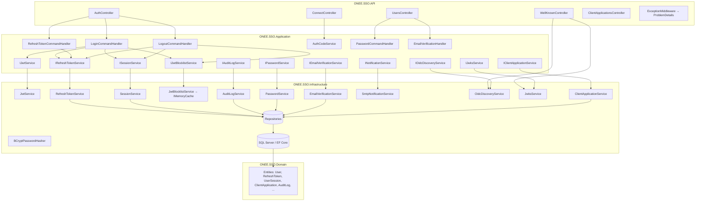
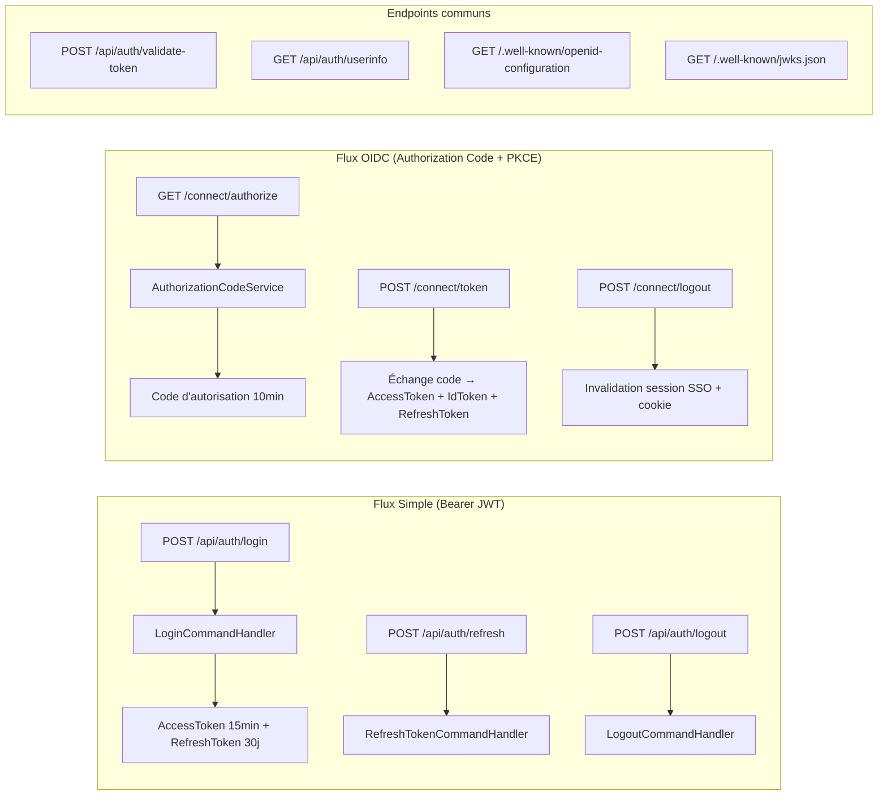
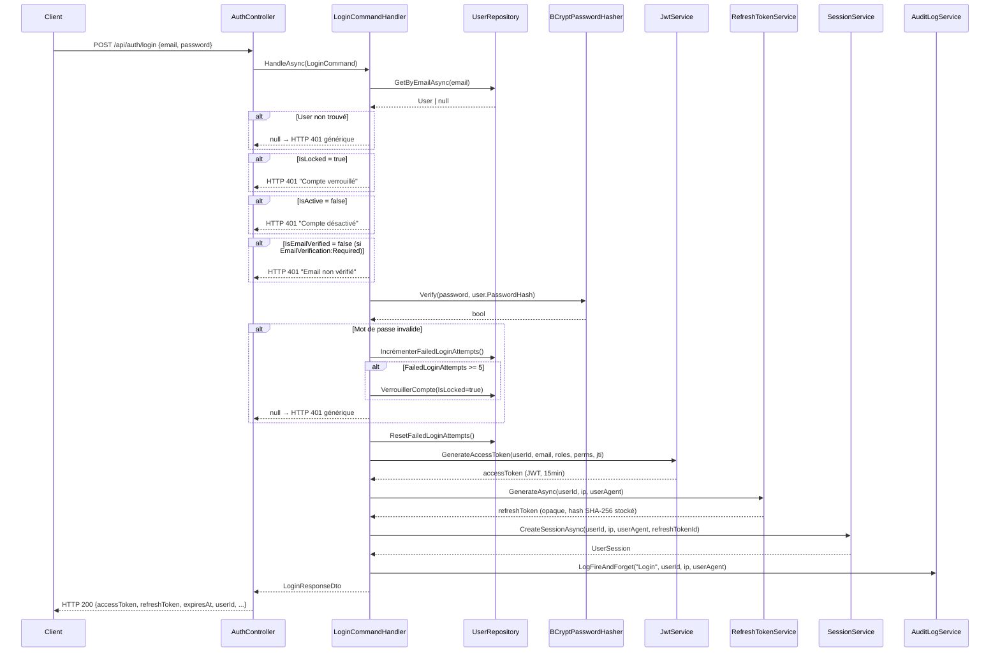
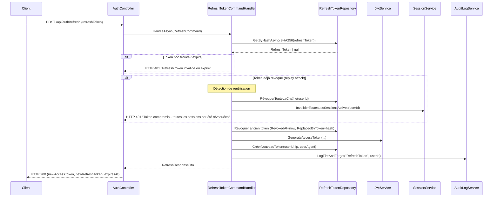
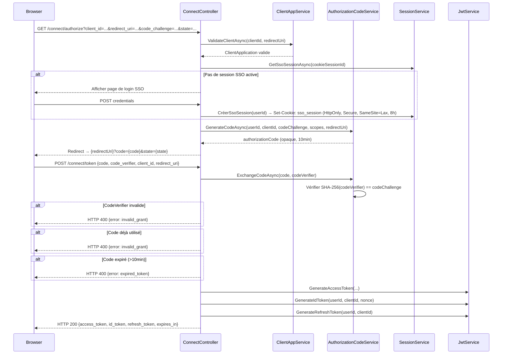
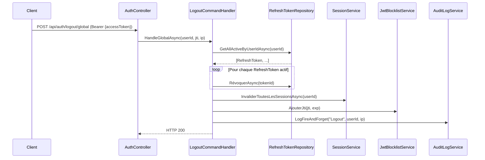

# Document de Design : ONEE.SSO Core Completion

## Vue d'ensemble

ONEE.SSO est un microservice Identity Provider (IdP) centralisé basé sur ASP.NET Core 9 et Clean Architecture. La base (entités, repositories, CRUD, login JWT simple) est déjà en place. Ce document décrit l'architecture et la conception technique des 12 fonctionnalités restantes pour atteindre un SSO production-ready : rotation des refresh tokens, logout, OIDC discovery, Authorization Code Flow + PKCE, gestion des ClientApplications, audit log, gestion des mots de passe, blocage de compte, vérification d'email, ProblemDetails, et endpoints validate-token/userinfo.

La philosophie de conception est de **préserver la compatibilité ascendante** : le flux login simple (`POST /api/auth/login` → JWT Bearer) reste fonctionnel et coexiste avec le flux OIDC complet (`/connect/*`).

---

## Architecture

### Vue d'ensemble des couches



### Coexistence des deux flux d'authentification



---

## Diagrammes de séquence des flux principaux

### Flux 1 : Login + création de session + émission de RefreshToken



### Flux 2 : Rotation du RefreshToken



### Flux 3 : Authorization Code Flow + PKCE



### Flux 4 : Logout global (tous les appareils)



---

## Modèle de données — Champs à ajouter aux entités existantes

### Entité `User` — Nouveaux champs

```csharp
// Migration: AddUserSecurityFields
public class User : BaseAuditableEntity
{
    // === Champs existants ===
    // FirstName, LastName, Email, PasswordHash, IsActive, ...

    // === Blocage de compte (Requirement 9) ===
    public int FailedLoginAttempts { get; set; } = 0;
    public DateTime? LastFailedLoginAt { get; set; }
    public bool IsLocked { get; set; } = false;
    public DateTime? LockedAt { get; set; }

    // === Vérification email (Requirement 10) ===
    public bool IsEmailVerified { get; set; } = false;
    public string? EmailVerificationToken { get; set; }       // Hashé SHA-256
    public DateTime? EmailVerificationTokenExpiresAt { get; set; }

    // === Réinitialisation mot de passe (Requirement 8) ===
    public string? PasswordResetToken { get; set; }           // Hashé SHA-256
    public DateTime? PasswordResetTokenExpiresAt { get; set; }
    public bool PasswordResetTokenUsed { get; set; } = false;

    // === Compteur de renvoi de vérification (Requirement 10.6) ===
    public int VerificationResendCount { get; set; } = 0;
    public DateTime? LastVerificationResendAt { get; set; }
}
```

### Entité `RefreshToken` — Champs enrichis

```csharp
// La plupart des champs existent déjà. Ajouts :
public class RefreshToken : BaseAuditableEntity
{
    // === Champs existants ===
    // UserId, Token (sera le hash), ExpiresAt, RevokedAt, ReplacedByToken, CreatedByIp, RevokedByIp

    // === Nouveaux champs (Requirement 1, 2) ===
    public string TokenHash { get; set; } = string.Empty;     // SHA-256 du token en clair (remplace Token)
    public string? UserAgent { get; set; }                    // User-Agent lors de l'émission
    public Guid? SessionId { get; set; }                      // FK vers UserSession

    // Note: Token (valeur en clair) ne doit JAMAIS être persisté.
    // Renommer le champ existant 'Token' en 'TokenHash' via migration.
}
```

### Entité `UserSession` — Champs enrichis

```csharp
public class UserSession : BaseAuditableEntity
{
    // === Champs existants ===
    // UserId, SessionId, Device, Browser, OperatingSystem, IpAddress, LoginAt, LogoutAt, IsActive

    // === Nouveaux champs ===
    public string? UserAgent { get; set; }                    // User-Agent complet
    public Guid? RefreshTokenId { get; set; }                 // FK vers RefreshToken actif
    public string? SsoSessionCookieId { get; set; }           // ID du cookie SSO (flux OIDC)
    public Guid? ClientApplicationId { get; set; }            // FK vers ClientApplication (si OIDC)
}
```

### Nouvelle entité `AuthorizationCode`

```csharp
// Migration: AddAuthorizationCode
public class AuthorizationCode : BaseEntity
{
    public string CodeHash { get; set; } = string.Empty;      // SHA-256 du code
    public Guid UserId { get; set; }
    public string ClientId { get; set; } = string.Empty;
    public string RedirectUri { get; set; } = string.Empty;
    public string CodeChallenge { get; set; } = string.Empty; // Base64url(SHA-256(verifier))
    public string CodeChallengeMethod { get; set; } = "S256";
    public string Scopes { get; set; } = string.Empty;        // Espace-séparé
    public string? Nonce { get; set; }
    public DateTime ExpiresAt { get; set; }                   // now + 10 min
    public bool IsUsed { get; set; } = false;
    public DateTime CreatedAt { get; set; } = DateTime.UtcNow;

    public User User { get; set; } = null!;
}
```

### Entité `AuditLog` — Champ nullable `UserId`

```csharp
// Correction: UserId doit être nullable (null si action non authentifiée)
public class AuditLog : BaseAuditableEntity
{
    public Guid? UserId { get; set; }                         // Nullable (était non-nullable)
    // ... reste inchangé
}
```

---

## Surface API — Endpoints nouveaux ou modifiés

### AuthController (`/api/auth`)

| Méthode | Route | Auth | Description |
|---------|-------|------|-------------|
| POST | `/api/auth/login` | Public | Login simple (existant, enrichi) |
| POST | `/api/auth/refresh` | Public | Rotation RefreshToken (**nouveau**) |
| POST | `/api/auth/logout` | Bearer | Logout simple (**nouveau**) |
| POST | `/api/auth/logout/global` | Bearer | Logout tous appareils (**nouveau**) |
| POST | `/api/auth/validate-token` | Public | Validation token + claims (**nouveau**) |
| GET | `/api/auth/userinfo` | Bearer | Claims OIDC utilisateur (**nouveau**) |
| POST | `/api/auth/forgot-password` | Public | Demande reset mot de passe (**nouveau**) |
| POST | `/api/auth/reset-password` | Public | Reset avec token (**nouveau**) |
| POST | `/api/auth/change-password` | Bearer | Changement mot de passe (**nouveau**) |
| GET | `/api/auth/verify-email` | Public | Vérification email par token (**nouveau**) |
| POST | `/api/auth/resend-verification` | Public | Renvoi email de vérification (**nouveau**) |

### UsersController (`/api/users`)

| Méthode | Route | Auth | Description |
|---------|-------|------|-------------|
| POST | `/api/users/{id}/unlock` | Bearer (Admin) | Déblocage de compte (**nouveau**) |

### ConnectController (`/connect`)

| Méthode | Route | Auth | Description |
|---------|-------|------|-------------|
| GET | `/connect/authorize` | Cookie SSO / Public | Initiation Authorization Code Flow (**nouveau**) |
| POST | `/connect/token` | Public (client credentials) | Échange code → tokens (**nouveau**) |
| POST | `/connect/logout` | Public + id_token_hint | Logout SSO (**nouveau**) |

### WellKnownController (`/.well-known`)

| Méthode | Route | Auth | Description |
|---------|-------|------|-------------|
| GET | `/.well-known/openid-configuration` | Public | Métadonnées OIDC (**nouveau**) |
| GET | `/.well-known/jwks.json` | Public | Clé publique JWKS (**nouveau**) |

### ClientApplicationsController (`/api/client-applications`)

| Méthode | Route | Auth | Description |
|---------|-------|------|-------------|
| POST | `/api/client-applications/{id}/rotate-secret` | Bearer (Admin) | Rotation du ClientSecret (**nouveau**) |
| (existant) | ... | ... | CRUD existant inchangé |

---

## Composants et interfaces

### 1. `IJwtService` — Enrichi

```csharp
public interface IJwtService
{
    // Existant (signature modifiée pour ajouter jti, firstName, lastName)
    string GenerateAccessToken(
        Guid userId,
        string email,
        string firstName,
        string lastName,
        IEnumerable<string> roles,
        IEnumerable<string> permissions,
        string? clientId = null);

    // Nouveaux
    string GenerateIdToken(
        Guid userId,
        string email,
        string firstName,
        string lastName,
        string issuer,
        string clientId,
        string? nonce,
        DateTime issuedAt);

    ClaimsPrincipal? ValidateToken(string token, out string? failureReason);

    bool IsJtiRevoked(string jti);
}
```

### 2. `IJwtBlocklistService` — Nouveau

```csharp
public interface IJwtBlocklistService
{
    /// <summary>Ajoute un jti à la blocklist jusqu'à son expiration naturelle.</summary>
    void AddJti(string jti, DateTime tokenExpiry);

    /// <summary>Vérifie si un jti est révoqué.</summary>
    bool IsRevoked(string jti);
}
```

**Implémentation** : `JwtBlocklistService` utilise `IMemoryCache` avec expiration = `tokenExpiry`. Pour un déploiement multi-instance, remplacer par `IDistributedCache` (Redis).

```csharp
public class JwtBlocklistService : IJwtBlocklistService
{
    private readonly IMemoryCache _cache;

    public void AddJti(string jti, DateTime tokenExpiry)
    {
        var ttl = tokenExpiry - DateTime.UtcNow;
        if (ttl > TimeSpan.Zero)
            _cache.Set($"jti:{jti}", true, ttl);
    }

    public bool IsRevoked(string jti)
        => _cache.TryGetValue($"jti:{jti}", out _);
}
```

### 3. `IRefreshTokenService` — Enrichi

```csharp
public interface IRefreshTokenService
{
    // Existant (CRUD simple conservé)
    Task<IEnumerable<RefreshTokenDto>> GetAllAsync();
    Task<RefreshTokenDto?> GetByIdAsync(Guid id);
    Task RevokeAsync(Guid id);

    // Nouveaux
    Task<(string token, RefreshToken entity)> GenerateAsync(
        Guid userId, string ipAddress, string? userAgent);

    Task<RefreshToken?> GetByTokenAsync(string rawToken);  // Recherche par SHA-256

    Task RevokeAndReplaceAsync(
        RefreshToken oldToken,
        string newTokenHash,
        string? revokedByIp);

    Task RevokeAllByUserAsync(Guid userId);  // Détection replay attack

    Task DeleteExpiredAsync();               // Nettoyage planifié
}
```

### 4. `ISessionService` — Enrichi

```csharp
public interface ISessionService
{
    // Existant conservé
    Task<IEnumerable<UserSessionDto>> GetAllAsync();
    Task<UserSessionDto?> GetByIdAsync(Guid id);
    Task RevokeAsync(Guid id);

    // Nouveaux
    Task<UserSession> CreateSessionAsync(
        Guid userId,
        string? ipAddress,
        string? userAgent,
        Guid? refreshTokenId,
        string? ssoSessionCookieId = null,
        Guid? clientApplicationId = null);

    Task InvalidateSessionAsync(Guid sessionId);
    Task InvalidateAllUserSessionsAsync(Guid userId);
    Task<UserSession?> GetSsoSessionAsync(string cookieSessionId);
}
```

### 5. `IAuthorizationCodeService` — Nouveau

```csharp
public interface IAuthorizationCodeService
{
    Task<string> GenerateCodeAsync(
        Guid userId,
        string clientId,
        string redirectUri,
        string codeChallenge,
        string codeChallengeMethod,
        string scopes,
        string? nonce = null);

    Task<AuthCodeExchangeResult> ExchangeCodeAsync(
        string rawCode,
        string codeVerifier,
        string clientId,
        string redirectUri);
}

public record AuthCodeExchangeResult(
    bool Success,
    string? Error,      // "invalid_grant" | "expired_token"
    Guid? UserId,
    string? Scopes,
    string? Nonce);
```

### 6. `IPasswordService` — Nouveau

```csharp
public interface IPasswordService
{
    Task ForgotPasswordAsync(string email);

    Task<bool> ResetPasswordAsync(string rawToken, string newPassword);

    Task<bool> ChangePasswordAsync(
        Guid userId,
        string currentPassword,
        string newPassword,
        string currentRefreshToken);

    bool ValidatePasswordPolicy(string password);
}
```

**Politique de mot de passe** : 8–128 caractères, ≥1 majuscule, ≥1 chiffre, ≥1 caractère spécial (ASCII 33–47, 58–64, 91–96, 123–126).

### 7. `IEmailVerificationService` — Nouveau

```csharp
public interface IEmailVerificationService
{
    Task SendVerificationEmailAsync(Guid userId);

    Task<bool> VerifyEmailAsync(string rawToken);

    Task ResendVerificationAsync(string email);  // Lève RateLimitException si > 3/heure
}
```

### 8. `INotificationService` — Nouveau (interface)

```csharp
public interface INotificationService
{
    Task SendEmailAsync(
        string to,
        string subject,
        string body,
        bool isHtml = true);
}
```

**Note** : L'implémentation concrète (`SmtpNotificationService`) est hors scope de ce design. Une implémentation `NullNotificationService` (no-op) est fournie pour les environnements de développement.

### 9. `IAuditLogService` — Enrichi

```csharp
public interface IAuditLogService
{
    // Existant conservé
    Task<IEnumerable<AuditLogDto>> GetAllAsync(AuditLogFilter filter);

    // Nouveau : fire-and-forget
    void LogFireAndForget(
        string action,
        Guid? userId,
        string entityName,
        string? entityId = null,
        string? oldValues = null,
        string? newValues = null,
        string? ipAddress = null,
        string? userAgent = null);
}
```

**Pattern fire-and-forget** :

```csharp
public void LogFireAndForget(string action, Guid? userId, ...)
{
    // Exécution sur le ThreadPool — ne bloque pas le flux principal
    _ = Task.Run(async () =>
    {
        try
        {
            using var scope = _serviceProvider.CreateScope();
            var repo = scope.ServiceProvider.GetRequiredService<IAuditLogRepository>();
            await repo.AddAsync(new AuditLog { Action = action, UserId = userId, ... });
            await repo.SaveChangesAsync();
        }
        catch (Exception ex)
        {
            _logger.LogError(ex, "Échec de persistance AuditLog: {Action}", action);
            // Exception avalée intentionnellement — ne propage pas
        }
    });
}
```

### 10. `IOidcDiscoveryService` / `IJwksService` — Nouveaux

```csharp
public interface IOidcDiscoveryService
{
    OpenIdConfiguration GetConfiguration();
}

public interface IJwksService
{
    JsonWebKeySet GetJsonWebKeySet();
}
```

**`OpenIdConfiguration`** (JSON sérialisé vers `/.well-known/openid-configuration`) :

```csharp
public record OpenIdConfiguration
{
    [JsonPropertyName("issuer")]
    public string Issuer { get; init; }

    [JsonPropertyName("jwks_uri")]
    public string JwksUri { get; init; }

    [JsonPropertyName("authorization_endpoint")]
    public string AuthorizationEndpoint { get; init; }

    [JsonPropertyName("token_endpoint")]
    public string TokenEndpoint { get; init; }

    [JsonPropertyName("userinfo_endpoint")]
    public string UserinfoEndpoint { get; init; }

    [JsonPropertyName("end_session_endpoint")]
    public string EndSessionEndpoint { get; init; }

    [JsonPropertyName("response_types_supported")]
    public IEnumerable<string> ResponseTypesSupported { get; init; }

    [JsonPropertyName("grant_types_supported")]
    public IEnumerable<string> GrantTypesSupported { get; init; }

    [JsonPropertyName("subject_types_supported")]
    public IEnumerable<string> SubjectTypesSupported { get; init; }

    [JsonPropertyName("id_token_signing_alg_values_supported")]
    public IEnumerable<string> IdTokenSigningAlgValuesSupported { get; init; }

    [JsonPropertyName("scopes_supported")]
    public IEnumerable<string> ScopesSupported { get; init; }

    [JsonPropertyName("claims_supported")]
    public IEnumerable<string> ClaimsSupported { get; init; }
}
```

---

## Décisions de conception clés

### DC-1 : SHA-256 pour les tokens opaques, BCrypt pour les mots de passe

**Décision** : Les RefreshTokens, PasswordResetTokens, et EmailVerificationTokens sont stockés en base sous forme de hash SHA-256 (hex ou base64). Les mots de passe utilisent BCrypt (existant).

**Justification** :
- SHA-256 est approprié pour les tokens cryptographiquement aléatoires (256 bits d'entropie via `RandomNumberGenerator`) car il n'y a pas de menace de brute-force — la sécurité vient de l'entropie du token.
- BCrypt est nécessaire pour les mots de passe car ils ont une entropie variable et peuvent être bruteforcés.
- Jamais stocker la valeur en clair d'un token ou mot de passe en base.

### DC-2 : JwtBlocklistService avec IMemoryCache

**Décision** : Le `JwtBlocklistService` utilise `IMemoryCache` avec TTL = durée restante du JWT.

**Justification** :
- Les AccessTokens durent 15 minutes max. La blocklist n'a besoin de mémoriser que les JTI actifs au moment de la révocation.
- `IMemoryCache` est simple, sans dépendance externe, adapté pour une instance unique.
- **Limitation** : Dans un déploiement multi-instances (scale-out), passer à `IDistributedCache` (Redis). Ce changement est isolé dans l'implémentation — l'interface ne change pas.

### DC-3 : Coexistence Bearer JWT et Cookie SSO

**Décision** : Deux mécanismes d'authentification coexistent sans interférence.

| Aspect | Flux Bearer JWT | Flux OIDC (Cookie SSO) |
|--------|----------------|----------------------|
| Endpoint d'authentification | `POST /api/auth/login` | `GET /connect/authorize` |
| Session côté serveur | `UserSession` via RefreshToken | Cookie `sso_session` + `UserSession` |
| Durée de vie | AccessToken 15min, RefreshToken 30j | Cookie SSO 8h, AccessToken ≤1h, RefreshToken ≤24h |
| Usage | Applications mobiles, API | Applications web (browser redirect) |
| Logout | `POST /api/auth/logout` | `POST /connect/logout` |

### DC-4 : AuditLog fire-and-forget avec IServiceProvider

**Décision** : `AuditLogService.LogFireAndForget()` utilise `Task.Run()` avec un scope DI créé à l'intérieur de la tâche.

**Justification** :
- Ne pas bloquer le flux principal (Req 7.6 : même si l'opération principale échoue partiellement, le log doit être persisté).
- Le scope DI à l'intérieur de `Task.Run` évite les problèmes de scopes disposés (`IDbContext` scoped).
- Les erreurs de persistance sont avalées et loguées via `ILogger`, jamais propagées (Req 7.7).

### DC-5 : RefreshToken — Renommage de `Token` en `TokenHash`

**Décision** : Le champ `Token` de l'entité `RefreshToken` est renommé `TokenHash` via migration EF Core.

**Justification** : Le nom `Token` est ambigu (valeur en clair vs hash). `TokenHash` rend explicite qu'on stocke le hash SHA-256.

**Impact** : Migration EF Core requise (`RenameColumn`). Tous les usages existants du champ `Token` doivent être mis à jour. Le `RefreshTokenRepository` est le seul accès à cette colonne.

### DC-6 : ClientSecret — Hachage BCrypt ou SHA-256

**Décision** : Le `ClientSecret` est stocké en base avec BCrypt (cohérence avec le reste du système).

**Justification** : Bien que SHA-256 suffirait (entropie ≥256 bits), BCrypt est déjà présent et offre une protection homogène. Le secret en clair est retourné une seule fois à la création ou rotation.

### DC-7 : Validation PKCE avec S256 uniquement

**Décision** : Seul `code_challenge_method=S256` est supporté. La méthode `plain` est refusée.

**Justification** : La méthode `plain` n'offre aucune sécurité supplémentaire par rapport à l'absence de PKCE. RFC 7636 recommande S256.

### DC-8 : Cookie SSO — attributs de sécurité

**Décision** : `HttpOnly=true`, `Secure=true`, `SameSite=Lax`, `MaxAge=8h`, `Path=/connect`.

**Justification** :
- `HttpOnly` : Empêche l'accès JavaScript (XSS).
- `Secure` : HTTPS uniquement.
- `SameSite=Lax` : Protection CSRF tout en permettant le redirect SSO cross-site.
- `Path=/connect` : Le cookie ne sera envoyé qu'aux endpoints `/connect/*`.

---

## Migrations EF Core requises

| Migration | Description | Champs modifiés |
|-----------|-------------|-----------------|
| `AddUserSecurityFields` | Champs lockout + email verification + password reset | `User.*` |
| `RenameRefreshTokenColumn` | `Token` → `TokenHash`, ajout `UserAgent`, `SessionId` | `RefreshToken.*` |
| `AddUserSessionFields` | `UserAgent`, `RefreshTokenId`, `SsoSessionCookieId`, `ClientApplicationId` | `UserSession.*` |
| `AddAuthorizationCodeTable` | Nouvelle table `AuthorizationCodes` | Nouvelle table |
| `FixAuditLogNullableUserId` | `UserId` de non-nullable → nullable | `AuditLog.UserId` |

---

## Stratégie de test

### Tests unitaires

- `LoginCommandHandlerTests` : Scénarios compte verrouillé, désactivé, email non vérifié, mot de passe incorrect, tentatives max atteintes, login réussi → reset compteur.
- `RefreshTokenCommandHandlerTests` : Rotation normale, token révoqué (replay attack → révocation en cascade), token expiré.
- `PasswordServiceTests` : Politique mot de passe, reset avec token expiré/utilisé, changement avec ancien mot de passe incorrect.
- `JwtBlocklistServiceTests` : Ajout/vérification jti, expiration TTL.
- `AuthorizationCodeServiceTests` : Génération code, échange PKCE valide, code_verifier invalide, code déjà utilisé, code expiré.

### Tests d'intégration (basés sur `WebApplicationFactory`)

- `AuthFlowIntegrationTests` : Login → Refresh → Logout → Validate-token révoqué.
- `OidcFlowIntegrationTests` : Authorize → Token exchange → UserInfo → JWKS validation.
- `AccountLockoutIntegrationTests` : 5 échecs → compte verrouillé → déblocage admin → login réussi.
- `PasswordResetIntegrationTests` : Forgot → Reset → Ancien token invalide.

### Tests de propriétés (property-based)

Librairie recommandée : **FsCheck** (intégration xUnit).

- **Propriété** : Pour tout token généré par `GenerateAsync`, `GetByTokenAsync(token)` retourne l'entité correspondante.
- **Propriété** : Pour tout mot de passe respectant la politique, `ValidatePasswordPolicy` retourne `true`.
- **Propriété** : Un JWT dont le `jti` est dans la blocklist est toujours rejeté par `ValidateToken`, quelle que soit sa signature.

---

## Considérations de sécurité

- **Timing attacks** : Les comparaisons de hashes utilisent `CryptographicOperations.FixedTimeEquals` pour les tokens et `BCrypt.Verify` pour les mots de passe.
- **Log sanitization** : Les valeurs de tokens (en clair) ne doivent jamais apparaître dans les logs. Seuls les hashes ou les identifiants tronqués sont loggués.
- **Rate limiting** : Le renvoi de tokens de vérification email est limité à 3/heure par utilisateur. Un rate limiting global sur `/api/auth/login` doit être configuré au niveau infrastructure (reverse proxy ou middleware).
- **Rotation de secret ClientApp** : L'ancien secret est invalidé immédiatement. Aucune période de transition.
- **Durées de vie** : AccessToken 15min (flux Bearer) / ≤1h (flux OIDC), RefreshToken 30j (flux Bearer) / ≤24h (flux OIDC), Code d'autorisation 10min, Cookie SSO 8h, PasswordResetToken 1h, EmailVerificationToken 24h.

---

## Dépendances NuGet à ajouter

| Package | Projet | Usage |
|---------|--------|-------|
| `System.IdentityModel.Tokens.Jwt` | Infrastructure | Déjà présent — enrichir pour `jti`, `given_name`, `family_name` |
| `Microsoft.Extensions.Caching.Memory` | Infrastructure | `JwtBlocklistService` |
| `Microsoft.AspNetCore.Authentication.JwtBearer` | API | Middleware auth JWT (si pas déjà présent) |
| `Swashbuckle.AspNetCore` | API | Déjà présent — ajouter XML comments |

**Note** : Aucune dépendance externe lourde (ex. IdentityServer, OpenIddict) n'est introduite. Toute la logique OIDC est implémentée manuellement pour garder le contrôle total et limiter la surface d'attaque.
